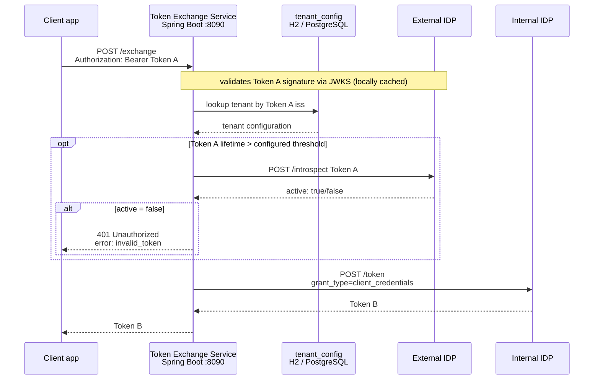

# token-exchange-service

> ⚠️ **This project is a POC (Proof of Concept) for study purposes.**
> It is not recommended to use it directly in production without proper security adaptations, such as secret encryption, persistent database, HTTPS, rate limiting, and access auditing.

Middleware service (Security Token Service) for exchanging tokens between different identity providers in multi-tenant environments.

---

## Overview

Allows client applications to exchange a token issued by their identity provider (External IDP) for a valid token in your identity provider (Internal IDP), without relying on Keycloak's native token exchange - eliminating the risk of breaking changes on version upgrades.

> The tutorials in `docs/` use Keycloak as the reference IDP. The service works with any OIDC-compliant identity provider that supports RFC 7662 token introspection.



---

## How it works

1. The client application sends Token A in the `Authorization: Bearer` header
2. Spring Security validates Token A's signature via the external IDP's JWKS (locally cached - no HTTP call per request)
3. The service extracts the `iss` claim from Token A and looks up the tenant configuration in the database
4. If Token A's lifetime exceeds the configured threshold, an introspection call is made to the external IDP to check for revocation
5. The service authenticates against the internal IDP via `client_credentials` and returns Token B

---

## Tech stack

- Java 25
- Spring Boot 4.0.4
- Spring Security OAuth2 Resource Server
- Spring Data JPA
- H2 (POC) / PostgreSQL (production)
- Docker - `eclipse-temurin:25-jdk` (build) / `eclipse-temurin:25-jre` (runtime)

---

## Project structure

```
token-exchange-service/
├── Dockerfile
├── docs/
│   ├── README.md                              - setup guide (all approaches)
│   ├── docker-compose.yml                     - Keycloak instances and service containers (POC)
│   ├── build.sh                               - automated end-to-end setup script
│   ├── tutorial-ui.md                         - manual setup via Keycloak Admin Console
│   └── tutorial-cli.md                        - manual setup via curl
├── src/main/java/com/example/tokenexchange/
│   ├── TokenexchangeApplication.java
│   ├── api/
│   │   ├── HealthController.java  
│   │   └── TokenExchangeController.java       - HTTP layer only
│   ├── domain/
│   │   ├── TenantConfig.java                  - JPA entity
│   │   ├── TenantConfigRepository.java        - data access
│   │   ├── TokenExchangeService.java          - business logic
│   │   └── TokenExchangeException.java        - domain exception
│   └── infrastructure/
│       ├── config/
│       │   ├── AppConfig.java                 - beans (RestClient, etc.)
│       │   └── SecurityConfig.java            - Spring Security filter chain
│       ├── idp/
│       │   ├── TokenIntrospectionClient.java  - introspection on external IDP (RFC 7662)
│       │   └── TokenIssuerClient.java         - client_credentials on internal IDP (RFC 6749 §4.4)
│       └── security/
│           └── MultiTenantJwtDecoder.java     - JWKS per tenant
├── src/main/resources/
│   ├── application.yml
│   └── data.sql                               - tenant seed data (generated by build.sh or set manually)
└── pom.xml
```

---

## Quick start

The fastest way to get everything running locally:

```bash
# 1. Add host.docker.internal to /etc/hosts (if not already present)
echo "127.0.0.1 host.docker.internal" | sudo tee -a /etc/hosts

# 2. Run the automated setup script
chmod +x docs/build.sh
./docs/build.sh
```

The script configures both Keycloak instances (used as IDPs in the POC), generates `data.sql`, builds the Docker image, starts the service, and runs the token exchange test - interactively, step by step.

For manual setup options, see [`docs/README.md`](docs/README.md).

---

## Endpoint

### POST /exchange

Exchanges Token A (from the client's identity provider) for Token B (from your identity provider).

**Request:**
```http
POST /exchange
Authorization: Bearer <Token A>
```

**Response (200):**
```json
{
  "access_token": "eyJhbGci...",
  "token_type": "Bearer"
}
```

**Response (401 - invalid or revoked token):**
```json
{
  "error": "invalid_token",
  "error_description": "Token A is invalid or revoked"
}
```

**Response (401 - unknown tenant):**
```json
{
  "error": "unknown_issuer",
  "error_description": "No tenant configured for issuer: http://..."
}
```

---

## Token validation - JWKS vs Introspection

The service uses a hybrid approach:

| Situation | Strategy |
|-----------|----------|
| Always | Validates signature via JWKS (local, no HTTP call per request) |
| lifetime > `max_token_lifetime_minutes` | Performs introspection on the external IDP to check for revocation |
| lifetime ≤ `max_token_lifetime_minutes` | Skips introspection |

JWKS keys are automatically cached by `NimbusJwtDecoder`. On key rotation in the external IDP, new keys are fetched automatically when an unknown `kid` is encountered.

---

## Multi-tenant

Each tenant (external client) is a row in `tenant_config`. Adding a new tenant requires no redeploy - just an INSERT:

```sql
INSERT INTO tenant_config (
    tenant_name, issuer_uri, introspection_uri,
    external_client_id, external_client_secret,
    internal_token_uri, internal_client_id, internal_client_secret,
    jwks_uri, max_token_lifetime_minutes
) VALUES (
    'client-b',
    'http://idp-client-b.com/realms/realm-b',
    'http://idp-client-b.com/realms/realm-b/protocol/openid-connect/token/introspect',
    'broker-client-b', 'secret-broker-b',
    'http://<INTERNAL_IDP_HOST>/realms/<REALM>/protocol/openid-connect/token',
    'my-client-b', 'secret-my-client-b',
    null,
    15
);
```

| Field | Description |
|-------|-------------|
| `tenant_name` | Tenant identifier - for logging and management only |
| `issuer_uri` | External IDP issuer - must match the `iss` claim in Token A |
| `introspection_uri` | Introspection endpoint of the external IDP (RFC 7662) |
| `external_client_id` | Client ID in the external IDP authorized to introspect |
| `external_client_secret` | Secret of the external client |
| `internal_token_uri` | Token endpoint of the internal IDP - use `host.docker.internal` when running in Docker |
| `internal_client_id` | Client ID in the internal IDP (requires Service Account enabled) |
| `internal_client_secret` | Secret of the internal client |
| `jwks_uri` | JWKS URL of the external IDP - if null, discovered via `{issuerUri}/.well-known/openid-configuration` |
| `max_token_lifetime_minutes` | Lifetime threshold in minutes for the JWKS vs introspection decision |

---

## H2 console (POC)

```
URL:      http://localhost:8090/h2-console
JDBC URL: jdbc:h2:mem:tokenexchange
Username: sa
Password: 123
```

---

## Production considerations

| Topic | Recommendation |
|-------|---------------|
| Database | Replace H2 with PostgreSQL |
| Secrets | Store encrypted - never in plain text. Use Vault or environment variables |
| HTTPS | Mandatory - Token A travels in the Authorization header |
| Token B | Is a `client_credentials` token (service account) - does not carry the original user's data. If propagating the user identity is required, use the internal IDP's Protocol Mappers to inject custom claims extracted from Token A |
| Custom claims | Configure Protocol Mappers in the internal IDP per client for fixed claims per tenant |
| Endpoint exposure | Protect `/exchange` with rate limiting, HTTPS, and optionally mTLS or API key |
| Scalability | The service is stateless - scales horizontally without additional configuration |

---

## Why not use Keycloak's native token exchange?

> Evaluated on Keycloak **26.5.6**.

| | Legacy V1 (native Keycloak) | This service |
|--|----------------------------|-------------|
| Status on KC-26 | Preview / deprecated | Version-independent |
| Exchange between different IDPs | Supported | Supported |
| Upgrade risk | High | Zero |
| Token B carries original user | Yes | No (service account) |
| Configuration complexity | High (FGAP v1 required) | Low |
| Multi-tenant | One IDP per client in the same realm, configured via FGAP v1 | One database record per client - adding a client is just an INSERT |

The main advantage of this service over Keycloak's native approach:

- **Version independence** - Legacy V1 is preview and deprecated in KC-26, with a real risk of breaking on upgrades
- **Full control over the flow** - hybrid JWKS + introspection validation, customizable business rules
- **Database-driven configuration** - adding or removing a client requires no Keycloak access, just an INSERT/DELETE on `tenant_config`

**Sources:**

- Token Exchange V1 vs V2 comparison, federated exchange status ("Not implemented yet" on V2), and preview classification:
  [Keycloak - Configuring and using token exchange](https://www.keycloak.org/securing-apps/token-exchange)

- FGAP v1 requirement for Legacy V1:
  [Keycloak Server Administration - Fine-grained admin permissions v1](https://www.keycloak.org/docs/latest/server_admin/#fine-grained-admin-permissions-v1)

- Definition of "preview" feature status and support policy (upgrade risk):
  [Keycloak - Enabling and disabling features](https://www.keycloak.org/server/features)

---

## Road to production

This POC demonstrates the concept but requires several adaptations before being production-ready. Below is what needs to be done, grouped by priority.

### Must have

**Replace H2 with PostgreSQL**
H2 is in-memory - all tenant data is lost on restart. Switch to a persistent database with a proper connection pool.

**Encrypt secrets at rest**
`external_client_secret` and `internal_client_secret` are stored in plain text in `tenant_config`. In production, encrypt them before persisting (e.g. using AES with a key stored in Vault or a KMS) and decrypt on read inside `TokenIntrospectionClient` and `TokenIssuerClient`.

**HTTPS everywhere**
Token A travels in the `Authorization` header on every request. All communication - client > service, service > external IDP, service > internal IDP - must use HTTPS with valid certificates.

**Externalize configuration**
Secrets like database credentials must never live in `application.yml` committed to source control. Use environment variables, Kubernetes secrets, or a secrets manager (HashiCorp Vault, AWS Secrets Manager, etc.).

**Rate limiting on `/exchange`**
The endpoint is public and unauthenticated at the network level. Protect it with a rate limiter (Spring Cloud Gateway, Kong, Nginx, or a library like Bucket4j) to prevent abuse and token harvesting attempts.

---

### Should have

**Tenant management API**
Replace `data.sql` seed with a proper `POST /tenants` endpoint - authenticated, audited, and with validation. Eliminates the need for direct database access to add or remove tenants.

**Audit log**
Log every exchange attempt - tenant, timestamp, outcome (success/failure), reason. Essential for security monitoring and incident response.

**Token B caching**
Token B is generated on every request via `client_credentials`. Cache it (e.g. with Spring Cache + Redis) with a TTL slightly below `expires_in` to avoid hitting the internal IDP on every call at high volume.

**Health and readiness endpoints**
Expose `/actuator/health` with checks for the database and connectivity to the external and internal IDPs. Required for orchestrators like Kubernetes to manage the service lifecycle correctly.

**Graceful degradation**
If the external IDP's JWKS endpoint is temporarily unreachable, the service currently fails. Consider a short-lived cache for JWKS keys with a configurable TTL to tolerate brief outages.

---

### Nice to have

**Propagate original user claims**
Token B is a service account token - it does not carry the original user's identity. For use cases that require it, implement claim mapping: extract `sub`, `preferred_username`, and `email` from Token A and inject them as custom claims in Token B via the internal IDP's Protocol Mappers or a custom mapper in the service.

**Per-tenant token lifetime policy**
The `max_token_lifetime_minutes` threshold is currently a single value per tenant. A finer-grained policy (e.g. always introspect for financial tenants, never for low-risk ones) could be modeled as a strategy per tenant.

**Metrics and tracing**
Integrate Micrometer + Prometheus for latency and error rate metrics per tenant. Add distributed tracing (OpenTelemetry) to correlate exchange requests across services.

**Dockerfile hardening**
The current `Dockerfile` is functional but not hardened. For production: pin the base image digest instead of tag, add `HEALTHCHECK`, set `--memory` and `--cpus` limits, and consider distroless or Chainguard images for a smaller attack surface.

---

### Summary

| Priority | Item |
|----------|------|
| Must | PostgreSQL, secret encryption, HTTPS, externalized config, rate limiting |
| Should | Tenant API, audit log, Token B cache, health endpoints, JWKS resilience |
| Nice to have | User claim propagation, per-tenant policy, metrics/tracing, Dockerfile hardening |

---

## Setup guide

See [`docs/README.md`](docs/README.md) for the full setup guide, including three approaches:

| Approach | Best for |
|----------|----------|
| [`docs/build.sh`](docs/build.sh) | Full automation - runs everything end-to-end |
| [`docs/tutorial-ui.md`](docs/tutorial-ui.md) | Learning - step-by-step via Keycloak Admin Console |
| [`docs/tutorial-cli.md`](docs/tutorial-cli.md) | Scripting - step-by-step via `curl` |
